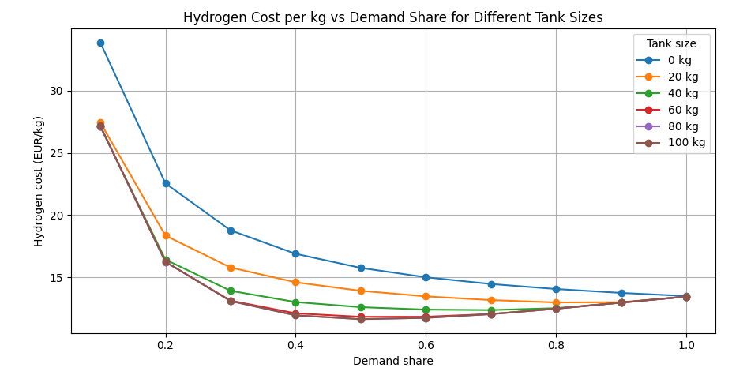

# Lavoit Linear Programming

The idea is to optimize the hydrogen production over the week, given the electricity price preditions.

I saw an opportunity to turn the setup into Linear Porgramming problem, through assuming a list of constants:

The constants are these:

- `TIMEPERIOD_DAYS`: how many days we optimize for.
- `TIMEPERIOD_HOURS`: the full horizon in hours.
- `TIMESTEP`, written later as $\Delta t$: the size of one optimization step.
- `P_RATED_KW`, written later as $P_{\mathrm{rated}}$: rated power of the electrolyser. Source: Jacob's letter, 1 MW.
- `P_BOP_KW`, written later as $P_{\mathrm{BOP}}$: the balance-of-plant power that is sort of always there. Source: [Source 4](https://reference-global.com/download/article/10.2478/lpts-2026-0011.pdf).
- `HOURLY_DEMAND_KG`, written later as $D$: the hourly hydrogen demand.
- `TANK_SIZE_KG`, written later as $T$: the max hydrogen tank size.
- `STACK_EFFICIENCY`, written later as $\eta$: stack efficiency. Source: [Source 3](https://www.sciencedirect.com/science/article/abs/pii/S0360319924034852).
- `E_HHV`, written later as $E_{\mathrm{HHV}}$: hydrogen higher heating value, used in the production formula.
- `COST_STACK_EUR`, written later as $C_{\mathrm{stack}}$: stack cost. Source: [Source 1](https://www.researchgate.net/publication/371160750_Present_and_future_cost_of_alkaline_and_PEM_electrolyser_stacks/link/64a56fab95bbbe0c6e16aa45/download?_tp=eyJjb250ZXh0Ijp7ImZpcnN0UGFnZSI6InB1YmxpY2F0aW9uIiwicGFnZSI6InB1YmxpY2F0aW9uIn19).
- `COST_BOP_EUR`, written later as $C_{\mathrm{BOP}}$: balance-of-plant cost. Source: total CAPEX from Jacob's letter, stack part from [Source 1](https://www.researchgate.net/publication/371160750_Present_and_future_cost_of_alkaline_and_PEM_electrolyser_stacks/link/64a56fab95bbbe0c6e16aa45/download?_tp=eyJjb250ZXh0Ijp7ImZpcnN0UGFnZSI6InB1YmxpY2F0aW9uIiwicGFnZSI6InB1YmxpY2F0aW9uIn19).
- `LIFETIME_STACK_KWH`, written later as $L_{\mathrm{stack}}$: stack lifetime in kWh terms. Source: [Source 2](https://cordis.europa.eu/project/id/256721/reporting#:~:text=Economical%20use%20of%20PEM%20fuel,as%20the%20initial%20investment%20cost.).
- `LIFETIME_BOP_H`, written later as $L_{\mathrm{BOP}}$: BOP lifetime in hours. Source: Jacob's letter, 15 years.
- `c_t`: electricity price at time $t$.
- `N`: number of days used to generate the electricity price signal.
- `MU`, written later as $\mu$: average electricity price level.
- `SIGMA_CYCLE`, written later as $\sigma_{\mathrm{cycle}}$: amplitude of the daily sinusoidal price cycle.
- `SIGMA_NOISE`, written later as $\sigma_{\mathrm{noise}}$: random noise on top of the cycle.

The sources used in the constants are these:

- [Source 1](https://www.researchgate.net/publication/371160750_Present_and_future_cost_of_alkaline_and_PEM_electrolyser_stacks/link/64a56fab95bbbe0c6e16aa45/download?_tp=eyJjb250ZXh0Ijp7ImZpcnN0UGFnZSI6InB1YmxpY2F0aW9uIiwicGFnZSI6InB1YmxpY2F0aW9uIn19): stack cost range.
- [Source 2](https://cordis.europa.eu/project/id/256721/reporting#:~:text=Economical%20use%20of%20PEM%20fuel,as%20the%20initial%20investment%20cost.): stack lifetime.
- [Source 3](https://www.sciencedirect.com/science/article/abs/pii/S0360319924034852): stack efficiency.
- [Source 4](https://reference-global.com/download/article/10.2478/lpts-2026-0011.pdf): BOP inefficiency / BOP share assumption.
- Jacob's letter: rated power, total CAPEX, and BOP lifetime.

The two key functions of the process are Costs and Hydrogen Production.

The Costs vary with productiona and electricity price as follows:

$$
\mathrm{Cost}_t = \mathrm{CAPEX} + \mathrm{OPEX}_t + \mathrm{Electricity}_t
$$

$$
\mathrm{OPEX}_t = p_t \cdot \Delta t \cdot \frac{C_{\mathrm{stack}}}{L_{\mathrm{stack}}}
$$

$$
\mathrm{Electricity}_t = p_t \cdot c_t \cdot \Delta t
$$

The Production can be modeled through:

$$
\mathrm{H}_t = \frac{(p_t - P_{\mathrm{BOP}})\cdot \eta \cdot \Delta t}{E_{\mathrm{HHV}}}
$$

We assume some constant hourly demand, therefore the optimzation target is the total costs of producing the required hydrogen.

There is lower constraint on production: the demand must be satisified - either through direct production or tank storage.

$$
\sum_{\tau=0}^{t} \mathrm{H}_{\tau} \geq D \cdot t
$$

There is upper constraint on production: can't produc more than demand & maximum size of the tank.

$$
\sum_{\tau=0}^{t} \mathrm{H}_{\tau} \leq D \cdot t + T
$$

We can write the statement of the problem as:

$$
\min_{p_t} \sum_{t=0}^{N-1} \mathrm{Cost}_t
$$

subject to

$$
P_{\mathrm{BOP}} \leq p_t \leq P_{\mathrm{rated}}
$$

$$
\sum_{\tau=0}^{t} \mathrm{H}_{\tau} \geq D \cdot t
$$

$$
\sum_{\tau=0}^{t} \mathrm{H}_{\tau} \leq D \cdot t + T
$$

## Figure

Below is the plotting of comparison of hydrogen price for a grid of starting conditions: 
Tanks sizes: 0,10,20...100
Demand for hydrogen and max trhough put ratios: 0.0,0.1,0.2,..1

The x axis is the demand share, meaning what fraction of the rated hydrogen production is actually demanded. The y axis is the hydrogen cost in EUR per kg.

Each line is one tank size. So the figure compares how storage changes the cost per kg when demand goes from low load to full load.

One detail: I have set the daily volatility of electricity cost quite high to make effect of tank and flexibility of production more visible...
If it's low - the lowest hydrogen costs is achieved with demand ratio = 1 and tank size of 0 :(

